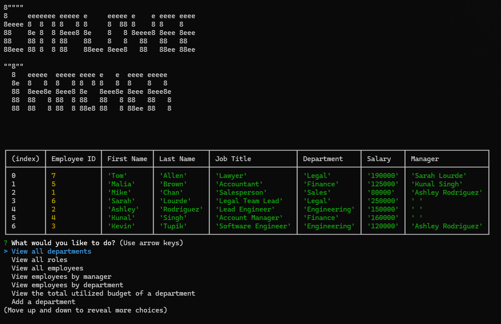

# Employee Tracker
  

  

## Description
  

This application (app) allows the user to view and manage the departments, roles, and employees in their company so they can organize and plan their business.
  

## Table of Contents
  

- [Installation](#installation)
  
- [Usage](#usage)
  
- [License](#license)
  
- [Contributing](#contributing)
  
- [Tests](#tests)
  
- [Questions](#questions)
  

## Installation
  

This app is not deployed so the user would need to copy the repo to their local machine to use it.
  

## Usage
  

A demonstration of how to use this application can be found at the following link: https://drive.google.com/file/d/1p9r77xWcmIQAjKXnJ5NvC835_DEeGFqF/view

To start the app, navigate in the terminal to the repository then type "node server.js".  The user will be greeted with the title of the app (Employee Tracker) and a menu.  The following is a description of each option:

### View All Departments
By selecting this option, all active departments with their associated ID's can be viewed.  Note that there is a department named "Unassigned" with an ID of 0.  This department is not displayed in this list because it is only used as a place holder should a department be deleted that has a role assigned to it.
  
### View All Roles
By selecting this option, all active roles (job titles) with their associated ID's, Departments and Salaries are shown.  Note that there is a role named "Unassigned" with an ID of 0.  This department is not displayed in this list because it is only used as a place holder should a role be deleted that has an employee assigned to it.

### View All Employees
By selecting this option, all employees are shown by first name and last name as well as their associated ID's, Job Titles, Departments, Salaries and Managers.

### View Employees by Manager
This function is similar to the View All Employees function; however, once selected, the user will be prompted to select a manager.  If the selected manager has any subordinates, the employee information for those subordinates only will be displayed.

### View Employees by Department
This function is similar to the View All Employees function; however, once selected, the user will be prompted to select a department.  If the selected department has any employees assigned to it, the employee information for the selected department only will be displayed.

### View the Total Utilized Budget of a Department
When this option is selected, the user will be prompted to choose a department.  Once chosen, a sum of the salaries of all the employees of that department will be displayed.

### Add a Department
When this option is selected, the user will be prompted to enter a name for the new department.  Once entered, the department is added to the database.

### Add a Role
When this option is selected, the user will be prompted to enter a name for the new role then the salary.  The user will be prompted to select the department to which the role will be assigned.  Once complete, the role is added to the database.

### Add an Employee
When this option is selected, the user will be prompted to enter the first and last name for the new employee.  The user will be prompted to select the role to which the employee will be assigned.  The user will finally be prompted to select the new employee's manager.  Once complete, the employee is added to the database.

### Update an Employee Role
When this option is selected, the user will be prompted to choose an employee before being prompted to choose the new role of that employee.  Once entered, the database is updated with the user's input.

### Update an Employee Manager
When this option is selected, the user will be prompted to choose an employee before being prompted to choose the new manager of that employee.  Once entered, the database is updated with the user's input.

### Delete a Department
When this option is selected, the user is prompted to choose a department to delete.  The selected department is removed from the database.

### Delete a Role
When this option is selected, the user is prompted to choose a role to delete.  The selected role is removed from the database.

### Delete an Employee
When this option is selected, the user is prompted to choose an employee to delete.  The selected employee is removed from the database.

### Exit
This option stops the app and returns the user to the terminal.  Note that the user can quit the app any time by pressing Ctrl + C.

[]

## License
  

This application is operating under the following license: **MIT License**.  
  

Further information regarding this license, to include the required notice, can be read by navigating to the following link: https://opensource.org/licenses/MIT.
  

## Contributing
  

Anyone wishing to contribute to this project can do so by contacting me via the information located in the "Questions" section below.
  

## Tests
  

There are no testing examples.
  

## Questions
  

Any questions regarding this project can be answered by contacting me through my GitHub profile or by email:
  
GitHub Profile: https://github.com/orian42
  
email: orian42@gmail.com